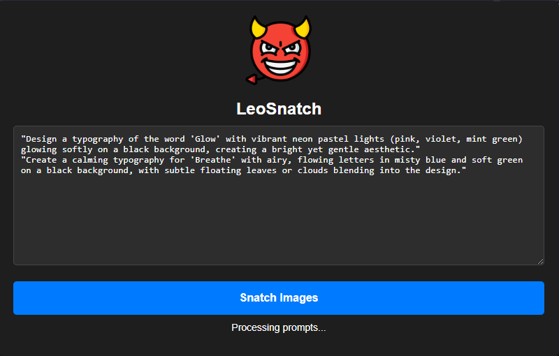

# LeoSnatch

**LeoSnatch** is a lightweight Chrome extension designed to automate the downloading of generated images from Leonardo prompts. Just paste your prompts, click start, and LeoSnatch takes care of the rest — snatching your creations at lightning speed!



## Features

- 🌟 Enter multiple prompts easily.
- ⚡ Automate typing, submitting, and downloading.
- 🎯 Skips unnecessary low-res images (_w=512).
- 🖤 Sleek dark mode UI.
- 🛠️ Simple and fast installation.
- 🧹 Minimal permissions required.

---

## Installation

1. Download or clone this repository:

    ```bash
    git clone https://github.com/your-username/leosnatch.git
    ```

2. Open **Google Chrome** and go to:  
   `chrome://extensions/`

3. Enable **Developer Mode** (top right corner).

4. Click **Load unpacked** and select the folder where you downloaded **LeoSnatch**.

5. You'll see the **LeoSnatch** icon  appear in your extensions.

---

## How to Use

1. Click the LeoSnatch extension icon.
2. Paste or type your prompts (one per line) into the textarea.
3. Click the **Start** button.
4. Sit back and watch as LeoSnatch auto-fills prompts, generates images, and downloads the results!

✅ Only downloads full-quality images.  
✅ Automatically processes multiple prompts one after another.

---

## File Structure

```
leosnatch/
├── icon.png         # Extension icon
├── popup.html       # Extension UI
├── popup.js         # Extension logic
├── manifest.json    # Extension manifest
├── sample.png       # Screenshot of the extension
└── README.md        # This file
```

---

## Requirements

- Google Chrome (or any Chromium-based browser)
- Access to Leonardo.ai platform

---

## Notes

- Make sure you're logged into Leonardo.ai when running the extension.
- Some network delays might slightly affect generation times — LeoSnatch waits before downloading.

---

## License

This project is licensed under the MIT License.

---

### ✨ Snatch your creativity effortlessly with **LeoSnatch**!

---
